# Interactive Classroom Experience | [Play on Itch.io](https://letisjamuco.itch.io/interactive-workspace-experience)
A Unity-based 3D environment recreating a realistic classroom setting.  
Originally created for the **Interactive Systems (M110)** course.

This project demonstrates simple first-person navigation, interactive objects, ambient sound, and dynamic lighting control.

### Screenshots

---

- Welcome

##### Instructions screen
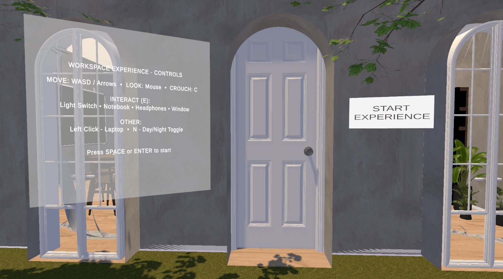
##### Open door
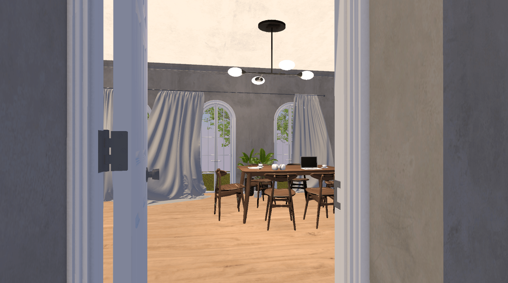

---

- Room Interior (Day & Night)

##### Room With Lights On — Day  
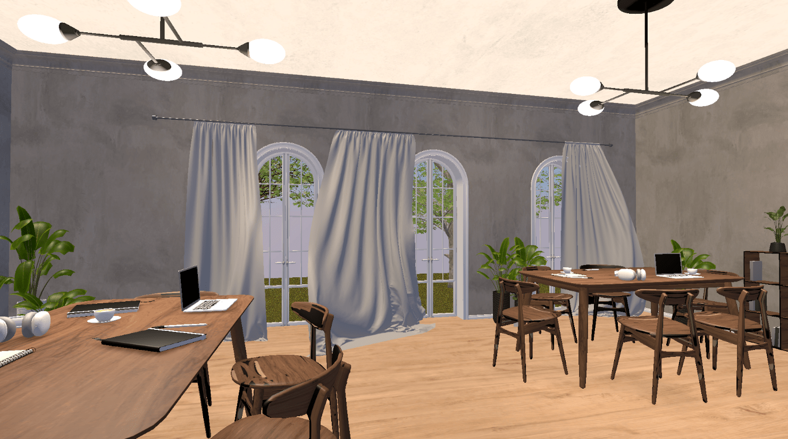
##### Room With Lights On — Night  
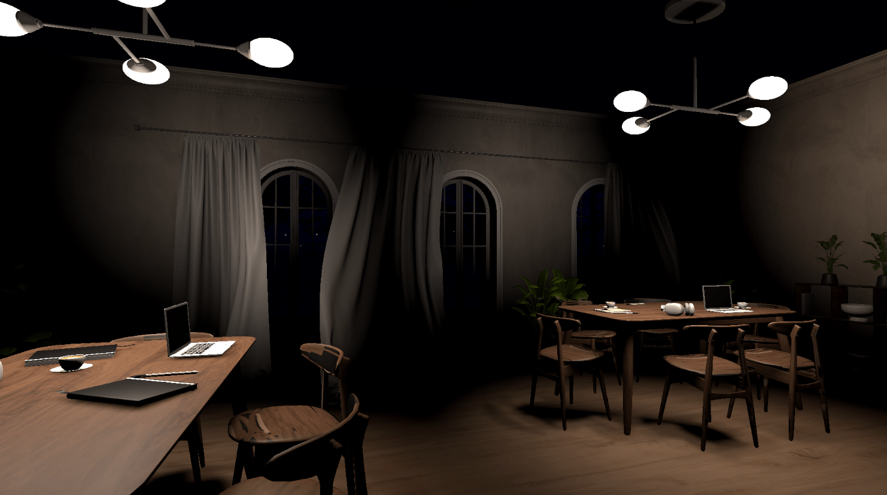
##### Room With Lights Off — Day  
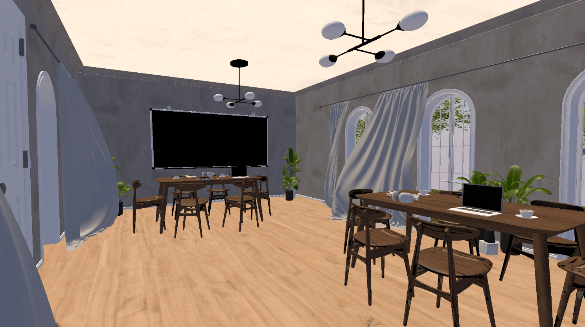
##### Window With Lights On — Night  
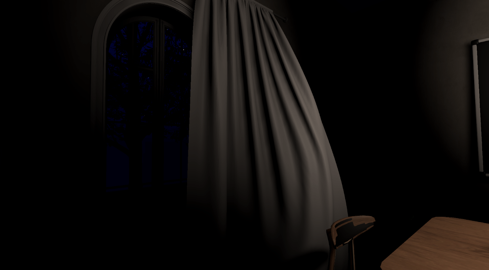

---

- Notebook Interaction

##### Notebook (Closed)  
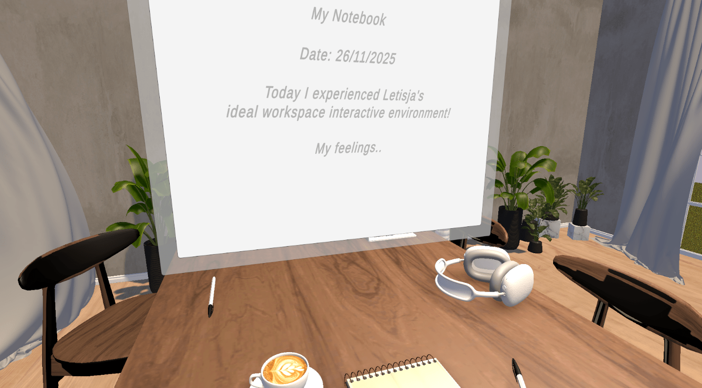

##### Notebook (Writing)  
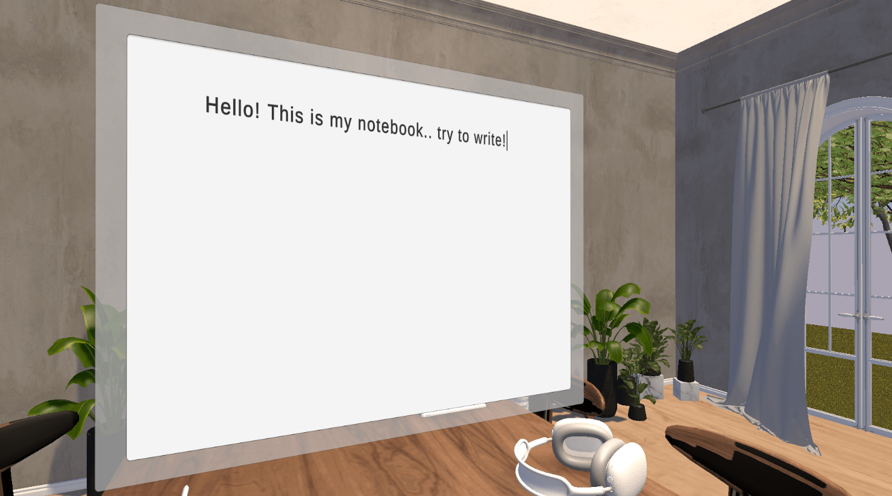

---

- Outside Environment (Day & Night)

##### Outside — Day  

##### Outside — Night  
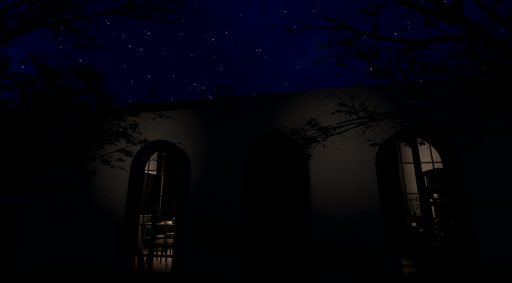

##### Outside Sky — Day  
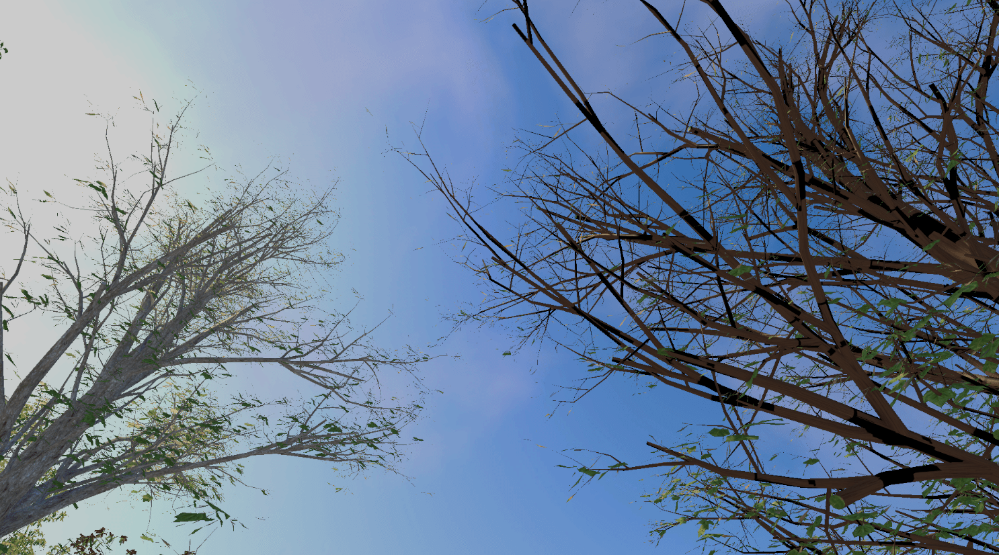
##### Outside Sky — Night  
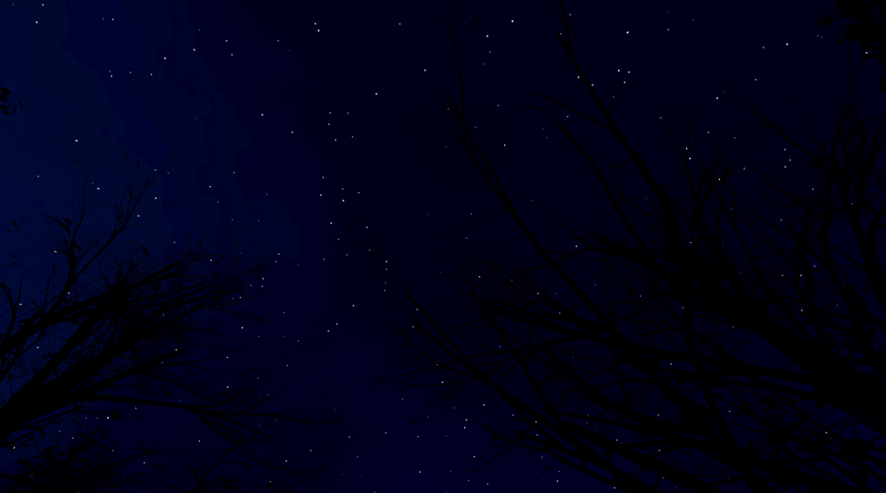

---
